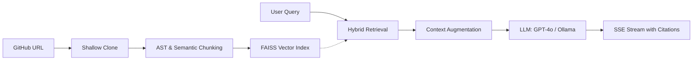

# GitGrok.AI

> **Unified Code Intelligence Platform** for deep repository analysis, interactive dependency mapping, and context-aware technical chat. Powered by RAG with GPT-4o and local LLM support via Ollama.

## System Workflow



## Core Features

- **Architecture Mapping**: Interactive force-directed graph visualizing project dependencies and module relationships.
- **Hybrid Retrieval**: Combines FAISS vector search with BM25-lite keyword matching for pinpoint accuracy.
- **Privacy-Forward**: Support for local LLM inference via Ollama to keep data within your infrastructure.
- **Technical Chat**: Streaming SSE interface providing cited answers with file snippets and line references.
- **Deep Analysis**: Automated security bug scanning and repository summarization.
- **File Explorer**: Real-time browsing of indexed repository structure with file-level summaries.

## Technology Stack

- **Frontend**: Next.js 14, TailwindCSS (for base layout), Vanilla CSS (for glassmorphism), Zustand, React Force Graph.
- **Backend**: FastAPI, SQLAlchemy (Async), FAISS (Vector DB), Celery + Redis.
- **LLM Engine**: OpenAI GPT-4o / GPT-4o-mini and Local Ollama Integration.

## Quick Start

### 1. Prerequisites
- Python 3.12+ 
- Node.js 20+
- Redis (optional but recommended for task queuing)

### 2. Installation

```bash
# Clone the repository
git clone https://github.com/Gautam-Bharadwaj/GitGrok.AI.git
cd GitGrok.AI

# Backend Setup
cd backend
python -m venv .venv && source .venv/bin/activate
pip install -r requirements.txt

# Frontend Setup
cd ../frontend
npm install
```

### 3. Configuration
Create a `.env` file in the root directory:
```env
OPENAI_API_KEY=your_key_here
LLM_PROVIDER=openai # or ollama
OLLAMA_BASE_URL=http://localhost:11434
```

### 4. Running the Application
```bash
# Start Backend
cd backend && python run.py

# Start Frontend
cd frontend && npm run dev
```

## Security & Privacy
- Zero-retention strategy for shallow clones (user configurable).
- Sandboxed AST parsing for code chunking.
- Secure token handling for private repository access.

---
MIT (c) 2026 GitGrok.AI - Automated Code Intelligence.
